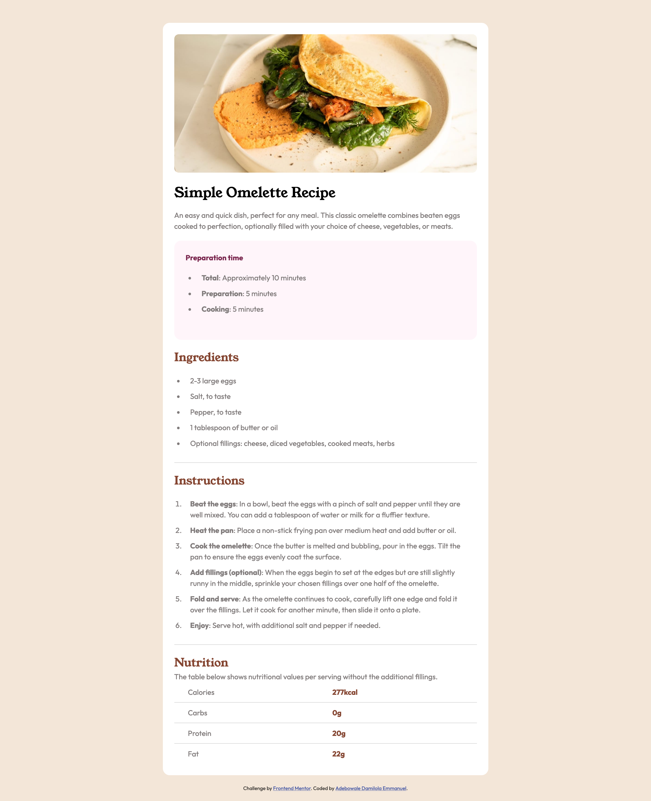

# Frontend Mentor - Recipe page solution

This is a solution to the [Recipe page challenge on Frontend Mentor](https://www.frontendmentor.io/challenges/recipe-page-KiTsR8QQKm). Frontend Mentor challenges help you improve your coding skills by building realistic projects. 

## Table of contents

- [Overview](#overview)
  - [The challenge](#the-challenge)
  - [Screenshot](#screenshot)
  - [Links](#links)
- [My process](#my-process)
  - [Built with](#built-with)
  - [How to Run](#how-to-run)
- [Author](#author)

## Overview

### Screenshot

### Links

- Live Site URL: [Recipe page ](https://damilordz.github.io/recipe-page-main/)

## My process

### Built with

- Semantic HTML5 markup
- CSS custom properties

### How to Run

1. Clone this repository to your local machine
2. Open index.html in your web browser

## Author

- Frontend Mentor - [Damilordz](https://www.frontendmentor.io/profile/Damilordz)
- Twitter - [Damilordz](https://www.twitter.com/Damilordz)
- LinkedIn - [Damilola](https://www.linkedin.com/in/adebowaleemmanuel)